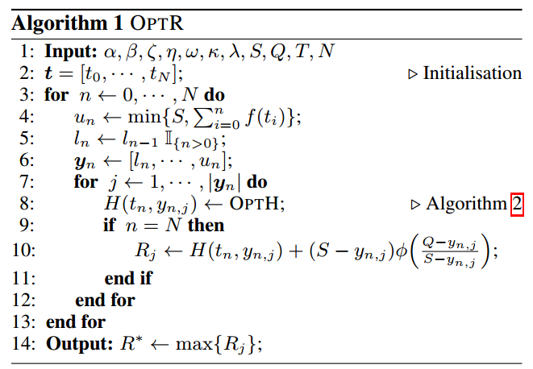
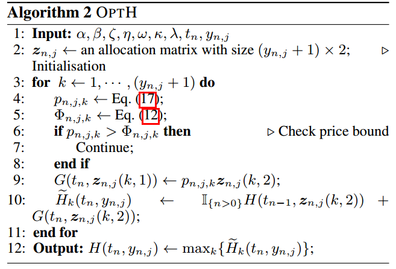
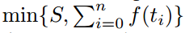
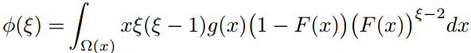
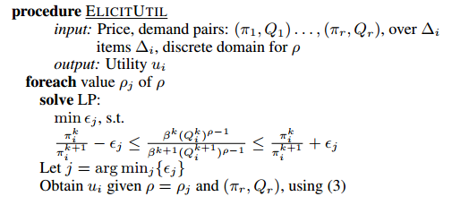
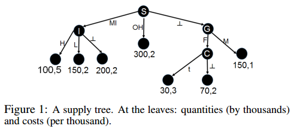

## Paper1:Combining guaranteed and spot markets in display advertising: selling guaranteed page views with stochastic demand

### 1.paper总结
#### 1.1.这个paper主要是合约端的优化。  
##### &emsp;&emsp;在已经预测出supply和demand的基础之上，通过DP的办法遍历所有合约端分配impression数量的可能，求出一个最优的合约端收益，这个最优化的过程中确定了两件事情：  
##### &emsp;&emsp;第一件，分配给合约多少流量。第二件，合约流量的价格。然后剩余的流量给RTB，直接求了一下在上面最优条件下对应RTB的一个期望值。最后R=R=RPG+RRTB
#### 1.2.使用LOWESS(局部加权的回归算法)先预测supply(将来可提供的impression)和demand(将来impression的需求)
#### 1.3.这篇paper model的两个实验现象。
##### &emsp;&emsp;a.当market竞争比较激烈(buyers比较多)的时候，成交的bid价格反而低
##### &emsp;&emsp;b.当market竞争比较激烈(buyers比较多)的时候，由于合约价格在缓慢的增长，这时候合约端往往能卖出更多的impression，此时的收益主要靠合约。但是当market竞争没那么激烈的时候，合约价格反而会增长的很快，这时候合约的impression却卖出去很少，这时候的主要收益依靠RTB.

#### 1.4.后面的可能优化方向：
##### &emsp;&emsp;a.本篇论文带有了很多假设，比如demand的到达是poisson分布，demand仅受到price以及time的影响，所有的impression是同等的，这些是一些优化方向
##### &emsp;&emsp;b.可以把buyer的策略考虑进来，这点作者在最后也有提到
##### &emsp;&emsp;c.直接把这篇论文和之前google在投放端的算法结合，这篇paper的model用于确定底价以及合约的数量，在RTB的环境中，使用google那篇paper的策略进行allocation.

### 2.算法概览

#### α：price effect to demand
#### β：time effect to demand
#### 𝜉：在一个RTB campaign里面的平均buyer人数
#### 𝜂：截止到时间t，还没有fill掉的demand
#### 𝜔：seller没能履行合约的概率
#### 𝜅:对于[0~tn]里面可能售出的impression的一种情况的第k种combination
#### 𝜆：假设到达的impression符合poisson分布，𝜆为强度，那么对于一个时间间隔的到达量就是𝜆*𝛻t
#### S：未来总的supply
#### Q：未来总的demand
#### T：在RTB开始之前离散时间戳的最后一个时刻
#### N：一共有N个离散的时刻
#### ln：到n时刻售出impression的最小值(guarantee)
#### un：到n时刻售出impression的最大值(guarantee)
#### yn：到n时刻所有可能的售出情况组成的一个向量(guarantee)
#### j：其中的一种可能售出impression的情况
#### H(tn, yn, j)：第j种可能售出的impression数目对应的最大合约收益（使用alg2进行求解，思路为DP，也就是遍历所有的[0,tn-1]和tn的combination，然后取最大的
#### φ(ξ)：RTB auction的收益
#### Rj：第j种可能对应的总收益

#### pn,j,k：对于第j种impression售出情况，第k种combination，tn时刻的合约价格
#### Φn,j,k：对于这种特定情况下，合约价格不能超过的一个最高价，超过的话会直接在解空间中去掉这个解
#### G(tn, zn, j(k,2))：这种情况下的单时刻的合约收益

### 3.算法解释
#### a.从合约场景下面的possible impression sold number(积累量)入手，对于一个时刻定义了当前时刻的sold number累积量(到上一时刻的累积量+当前时刻的时刻量)，然后这一种可能的情况进入上面的算法2
注：对于某一个时刻，possible impression sold number的最小值是上一时刻的最小值，最大值定义为：

S为总的supply，所以最多肯定不能超过这个。  
然后如果用不完supply，那么就是右边的公式。  
我们假设demand到达为poisson分布，f(ti)指的就是在时刻ti，demand到达量，所以右边的公式代表的含义就是到此时刻为止累积的demand数量

#### b.对于：上一时刻的累积量+当前时刻的时刻量，有很多种组合方式，为了寻求最佳的组合方式，直接遍历所有的组合方式求解在a步骤里面的最优解(DP)，也就是合约场景下面的max(RPG)
#### c.合约端在第j种sold number的最优解确定之后，就可以计算出来RTB剩余多少impression，然后根据这个算出来一个RTB的期望RRTB，两个相加就是在第j种合约端sold number下面的总R=RPG+RRTB
#### d.RRTB期望的计算方法：

#### 公式的解释：就相当于是首先求x作为二价的概率，然后再在x的所有可能情况上进行积分，最后得到的就是在一个competitive level上的期望auction收益.

## Paper2:Posted Prices Exchange for Display Advertising Contracts(2013 AAAI)
### 1.paper概览
### >> demand方面：对CES(constant elasticity of substitution) 建模。认为seller卖出的A广告的价格会影响B广告的demand，最后learn到一个constant，这个constant是不同Ad之间价格的改变，对彼此demand的影响.
### >> supply方面：使用decision-tree对不同类型impression的(quantities,cost)进行建模.tree上面的每一条path就是impression的不同attribute，每一个leaf节点的值为分到这个节点下面sample上面的pair取average.
#### 说白了，这个就是预测特定类型的流量在下一个period的inventory以及对应的price.
### >> model的合理性方面：证明了在这种market model的情况下，是可以找到一个最优的price的.

### 2.paper细节
#### >> demand方面:
##### 三个假设：Inelastic budget, Gross Substitutes，Constant elasticity of substitution (CES)

##### 第一个假设为每一个广告主都会有一个预算
##### 第二个假设为一个item price的增长会引起另外一个item的demand增加
##### 第三个假设就是描述了不同物品之间的价格改变可以迁移影响到对应的demand，并且假设这个影响的measurement是一个constant.

#### >> supply方面:

##### 1.使用树模型建模，loss函数为RMSE
##### 2.每一个节点是一个attribute，当一个sample在某个node上面没有值的时候，这个特征对应的就是unknown，此时就流向一个单独的分支.

### 3.改进:
#### 对于supply的建模可以使用目前比较流行的gbdt，而不是一棵简单的决策树.

## Paper3:Pricing guaranteed contracts in online display advertising
#### -ACM,2010
#### -定价端：基于impression的value进行定价，这个value主要由过去数据中seller和advertiser之间的历史price决定.
#### -other insight：可以关于这个value，我们可以使用更为先进的方法，比如RNN.  

## Paper4:Risk-aware revenue maximization in display advertising
#### -WWW,2012
#### -定价端：基于对未来demand的建模, 找到最大化revenue的contract price
